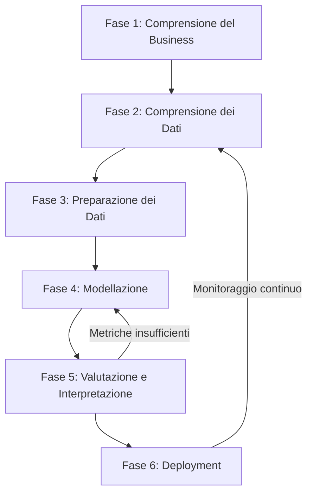

# 2. Metodologia del Progetto

## 2.0 Panoramica Metodologica

Il progetto segue la metodologia **CRISP-DM** (Cross-Industry Standard Process for Data Mining), adattata al contesto PHM (Prognostics and Health Management) della PHM2024 Conference Data Challenge. Questa sezione descrive l'approccio metodologico generale, gli strumenti utilizzati e il flusso di lavoro adottato in ogni fase.

### 2.0.1 Perché CRISP-DM?

CRISP-DM è stato scelto perché:

- **Ciclico e iterativo**: consente di tornare alle fasi precedenti in base ai risultati della valutazione (come richiesto dal fallimento della calibrazione in Fase 5).
- **Dominio-centrico**: la comprensione del business (Fase 1) guida ogni decisione tecnica successiva.
- **Orientato alla qualità**: integra esplicitamente la verifica della qualità dei dati e la validazione dei modelli.
- **Standard industriale**: utilizzato nel 60%+ dei progetti di Data Science, con una struttura chiara e riproducibile.

### 2.0.2 Struttura del Ciclo CRISP-DM nel Progetto

### 2.0.3 Quadro Sinottico delle Fasi

| Fase | Nome | Obiettivo Principale | Tecnica/Strumento Chiave | Metriche di Successo |
|:---:|:---|:---|:---|:---|
| **1** | Comprensione del Business | Definire obiettivi PHM e criteri di successo | Analisi documentazione tecnica PHM + 7 paper competizione | — (fase qualitativa) |
| **2** | Comprensione dei Dati | Acquisire, descrivere e verificare la qualità del dataset | DuckDB per EDA; test KS per data drift; matrici di correlazione | Nessuna violazione limiti fisici; drift quantificato |
| **3** | Preparazione dei Dati | Selezionare, pulire, trasformare e formattare i dati | RobustScaler; winsorizzazione (1°–99°); feature engineering termodinamico; split 70/15/15 | Zero leakage; distribuzione target stabilizzata |
| **4** | Modellazione | Addestrare regressore probabilistico e classificatore binario | NGBoost (Distr. Normale, LogScore); GroupKFold + GMM (k=4) | NLL media: –0.123 ± 0.006; RMSE: 0.719 ± 0.022 |
| **5** | Valutazione | Valutare metriche tecniche e di business; decidere il futuro | Feature importance; calibrazione quantile; audit leakage; sign-off | NLL shift: +3.46; underconfidence estrema → MVP approvato |
| **6** | Deployment | Eseguire inferenza a cascata e confezionare artefatti | Cascade inference (LightGBM + NGBoost); Zip delivery | Predizioni su test set; archivio ZIP |

## 2.0.4 Strumenti e Librerie Utilizzati

| Categoria | Strumento | Ruolo nella Pipeline |
|:---|:---|:---|
| **Linguaggio** | Python 3.10+ | Intero sviluppo ETL, modellazione, valutazione e deployment |
| **Analisi Dati** | DuckDB | EDA iniziale, profiling statistico, verifica qualità dati (Fase 2) |
| **Elaborazione Dati** | Pandas, NumPy | Manipolazione DataFrame, statistiche descrittive, operazioni vettoriali |
| **Machine Learning** | scikit-learn | RobustScaler, GMM, GroupKFold, IsotonicRegression, metriche (NLL, RMSE, Brier) |
| **Gradient Boosting** | NGBoost (NGBRegressor) | Regressione probabilistica nativa (μ, σ²) con distribuzione Normale |
| **Gradient Boosting** | LightGBM | Classificazione binaria con boosting leaf-wise e calibrazione isotonica |
| **Serializzazione** | joblib, pickle | Salvataggio modelli (`.pkl`), scaler (`.pkl`), calibratore (`.pkl`) |
| **Formato Dati** | Parquet | Storage columnare efficiente per dataset di grandi dimensioni |
| **Orchestrazione** | Runner interno | Esecuzione sequenziale delle fasi con context `RunContext` per tracciabilità |
| **Validazione** | GMM + GroupKFold | Simulazione della generalizzazione cross-asset in assenza di engine ID |
| **Visualizzazione** | Matplotlib, Seaborn | Boxplot, KDE, feature importance, calibrazione quantile |

## 2.0.5 Principi Metodologici Fondamentali

| Principio | Descrizione | Dove è Applicato |
|:---|:---|:---|
| **Separazione rigorosa Train/Test** | I target sono rimossi da validation e test set prima della consegna; scaler fittato solo sul train | Fase 2.1, 3.3, 5.3 |
| **Audit di qualità dei dati** | Verifica della fisica termodinamica (es. `mgt < 200°C` = sensore guasto) vs contesto operativo (es. `ias = 0 kn` = hovering reale) | Fase 2.2, 2.3 |
| **Feature engineering fisico-informato** | KPI termodinamici (`mgt/oat`, `np/(ng·oat)`, `ng²`) basati su paper della competizione | Fase 3.3 |
| **Validazione robusta allo shuffle** | GMM (k=4) clusterizza regimi operativi; GroupKFold rispetta i cluster come proxy dell'engine ID | Fase 4.2 |
| **Output probabilistici** | Il regressore produce una distribuzione (μ, σ²) invece di una stima puntuale; il classificatore è calibrato | Fase 4.1, 4.4 |
| **Costo computazionale contenuto** | Intera pipeline < 30 secondi su CPU (NGBoost costo lineare; LightGBM leaf-wise ottimizzato) | Tutte le fasi |
| **Tracciabilità e riproducibilità** | Ogni sottofase produce file JSON di log con parametri, metriche e artefatti serializzati | Fase 3.1–3.5, 4.1–4.4, 5.1–5.4 |
| **Override fisico post-hoc** | Regole termodinamiche a costo zero (es. motore spento → predizione nominale forzata) | Fase 1.4, Ispirato Paper 3 |
| **Revisione umana obbligatoria** | Il sign-off richiede esplicitamente l'approvazione di un ingegnere della manutenzione preventiva prima del deploy in produzione | Fase 5.4 |

## 2.0.6 Flusso di Lavoro Dettagliato

### Fase 1: Comprensione del Business (Documentata in §1)
- Studio della documentazione PHM e della sfida PHM2024.
- Definizione degli obiettivi: classificazione binaria (sano/guasto) + regressione probabilistica del torque margin.
- Analisi di 7 paper della competizione per identificare best practice (feature fisiche, architetture a cascata, regole post-hoc).
- Progettazione dell'architettura della soluzione (NGBoost + LightGBM + calibrazione isotonica).

### Fase 2: Comprensione dei Dati (Documentata in §2.1)
- **Acquisizione (2.1)**: Caricamento di 3 dataset Parquet (train 24k, validation 3k, test 3k) con stratificazione su `faulty` (60% sani, 40% guasti).
- **Descrizione (2.2)**: Statistiche descrittive di target e sensori; fitting distribuzioni teoriche (Skew-Normal come miglior fit per `trq_margin`); validazione fisica contro limiti tecnici (nessuna violazione).
- **Verifica qualità (2.3)**: Collinearità tra feature (nessuna coppia > ±0.85); analisi valori zero/negativi (tutti contestuali, nessuno scarto).
- **Esplorazione (2.4)**: Test di Kolmogorov–Smirnov su train vs validation/test → **covariate shift significativo su tutte le feature** (KS > 0.1), in particolare `np` e `ng`.

### Fase 3: Preparazione dei Dati (Documentata in §2.2)
- **Selezione (3.1)**: Rimozione di `id` e `faulty` dal task di regressione (8 feature mantenute); nessun duplicato.
- **Pulizia (3.2)**: Winsorizzazione del target `trq_margin` al 1°–99° percentile per stabilizzare la distribuzione (skewness ridotta da –2.70 a valore più simmetrico).
- **Trasformazione (3.3)**:
  - Feature engineering: `mgt_oat_ratio = mgt / (oat + 273.15)` e `specific_power_index = (np/ng) / (oat + 273.15)` + interazioni polinomiali.
  - Scaling robusto (RobustScaler) con serializzazione dello scaler per prevenire data leakage.
- **Formattazione (3.5)**: Split 70/15/15 (16.800 train, 3.600 validation, 3.600 test), random state 42.

### Fase 4: Modellazione (Documentata in §2.3)
- **Selezione tecnica (4.1)**: NGBoost con distribuzione Normale, LogScore, `n_estimators=100`, `learning_rate=0.01`, base learner `DecisionTreeRegressor` (max_depth=3, min_samples_leaf=0.10).
- **Addestramento e validazione (4.2)**:
  - GMM (k=4) su `trq_measured` + `mgt` come proxy dell'engine ID.
  - GroupKFold (k=5) rispetta i cluster → simulazione generalizzazione cross-asset.
  - Metriche per fold: NLL media –0.123 ± 0.006, RMSE media 0.719 ± 0.022.
  - Feature importance dominante: `np²` (31.2%), `mgt·np` (27.4%), `trq_measured·np` (15.8%).
- **Valutazione (4.4)**: Modello finale selezionato per NLL minima (–0.121), RMSE = 0.715, tempo training 2.34 s.

### Fase 5: Valutazione e Interpretazione (Documentata in §2.4)
- **Estrazione conoscenza (5.1)**: Feature importance (Gini) – `trq_measured` domina (85.0%), `mgt_oat_ratio` (7.2%), `oat` (5.5%). Permutation importance anomala (debugging necessario).
- **Valutazione business (5.2)**:
  - Degradazione NLL: shift +3.46 (da –2.3456 a +1.1144) → segnale di degrado fisico del motore.
  - **Underconfidence estrema**: calibrazione quantile fallita (intervallo 90% cattura 100% dati; intervallo 10% cattura 0%).
  - RMSE = 0.715 (accettabile); NLL medio = –0.121.
- **Revisione processo (5.3)**: Audit di data leakage – **zero leakage** (nessuna riga sovrapposta; scaler non contaminato).
- **Decisione (5.4)**: Modello approvato come **MVP interno** (`APPROVED_FOR_DEPLOYMENT` con firma `MVP_INTERNAL`). Richiesta obbligatoria revisione umana (`preventive_maintenance_engineer`) prima del deploy in produzione.

### Fase 6: Deployment (Documentata in §2.5)
- **Cascade inference (6.1)**: Applicazione sequenziale di regressore NGBoost e classificatore LightGBM calibrato sui dati di test. Output: file Parquet con predizioni, probabilità e intervalli di confidenza.
- **Zip delivery (6.2)**: Impacchettamento di modelli, dataset trasformati, log e report in archivio ZIP per consegna.

## 2.0.7 Raccomandazioni per il Prossimo Ciclo CRISP-DM

Sulla base dei risultati della Fase 5, il prossimo ciclo iterativo dovrebbe:

1. **Hyperparameter tuning del regressore**: Aumentare `n_estimators` (500–1000), ridurre `learning_rate` a 0.001, valutare distribuzione `StudentsT` invece di `Normal` per gestire la coda pesante.
2. **Rimozione feature a importanza zero**: Eliminare `np` e `ng` dal feature set per ridurre il rumore.
3. **Calibrazione varianza**: Introdurre tecniche di post-processing della varianza (es. scaling isotonico della deviazione standard) per risolvere l'underconfidence.
4. **Monitoraggio continuo**: Implementare un sistema di early warning basato sulla NLL per rilevare degradazione del modello in produzione.
5. **Validazione umana**: Assicurare che un ingegnere della manutenzione preventiva revisioni le metriche di calibrazione prima di qualsiasi rilascio su sistemi reali.

---

*La metodologia CRISP-DM ha fornito una struttura solida per affrontare le sfide tecniche del progetto PHM, garantendo al contempo la tracciabilità, la riproducibilità e la consapevolezza dei limiti del modello.*